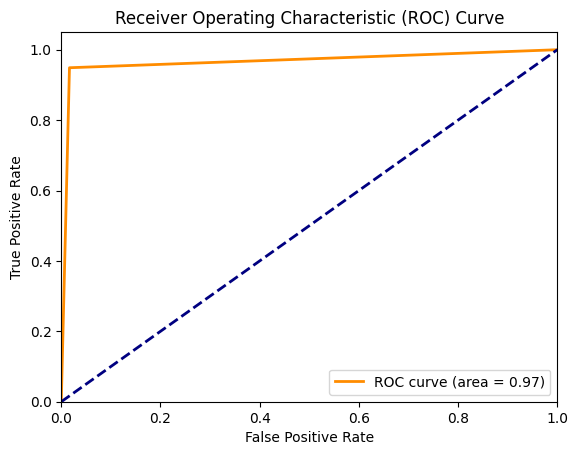

# GenAI
In this 3-day hackathon, we accomplished a full-stack webapp empowered by the state-of-the-art AI model which is able to give you a reminder to take a break essentially when you are stressed or down. This has been done by **emotion detection** which is a capability of the resulting [AI Model](./AI_Model/training/training_facial_emotion_recognition.ipynb). Download [this](./AI_Model/facial_emotion_recognition_model.h5) model. 

To achieve the facial emotion recognition capability, a CNN-based model is first constructed and trained upon the [olivetti_faces dataset](./AI_Model/dataset/olivetti_faces/), [ashwingupta3012 dataset](./AI_Model/dataset/ashwingupta3012/), and [aliasgartaksali](./AI_Model/dataset/aliasgartaksali/). This forms the [base model](./AI_Model/training/training_human_detection.ipynb) which can predict whether an image includes a human-being. Download [this](./AI_Model/human_face_detection_model.h5) for the base model. Afterwards, those layers are frozen and a transfer learning is applied onto another task - learning the [facial emotional recognition](./AI_Model/training/training_facial_emotion_recognition.ipynb), which is our [resulting model](./AI_Model/facial_emotion_recognition_model.h5) for a multi-class classification. It is based on the [apollo2506](https://www.kaggle.com/datasets/apollo2506/facial-recognition-dataset) dataset, the [olivetti_faces](https://www.kaggle.com/code/serkanpeldek/face-recognition-on-olivetti-dataset) dataset, and the [tapakah68](https://www.kaggle.com/datasets/tapakah68/facial-emotion-recognition) dataset. 

Note that we annotated the labels for the **olivetti_faces** dataset with **Google Gemini** since this dataset was originally not labelled. We assumed the LLM that we relied on is accurate enough. 

[**Our Pitch**](./Pitch%20Deck.pdf)**!!!**

## See how accurate we've got!

## Tech Stack 
**AI**
* CNN architecture
* Tensorflow (running on a GPU)
* Image Processing with Python: matplotlib, openCV. Check [this code](./AI_Model/image_preprocessing.py) for more details.

**The MERN Stack**
* Database - MongoDB
* Frontend - React
* Backend - Flask API